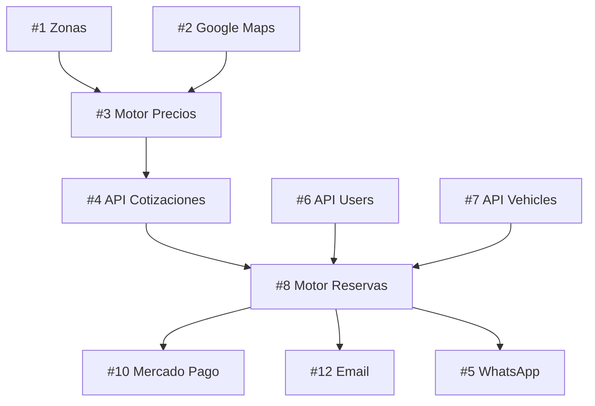

# 📋 GitHub Issues - PrivateLimo

Lista completa de issues para crear en GitHub organizados por Milestones y Epics.

## Milestones

1. **MVP Launch** - Todo lo necesario para el lanzamiento mínimo
2. **Phase 2: Real-time** - Funcionalidades en tiempo real
3. **Phase 3: Advanced** - Features avanzados y optimizaciones
4. **Infrastructure** - DevOps, testing, documentación

## Labels Sugeridos

- `priority: critical` - Bloqueante para lanzamiento
- `priority: high` - Importante, siguiente sprint
- `priority: medium` - Planificado
- `priority: low` - Nice to have
- `type: feature` - Nueva funcionalidad
- `type: bug` - Error a corregir
- `type: enhancement` - Mejora
- `type: docs` - Documentación
- `type: test` - Testing
- `backend` - Tarea de backend
- `frontend` - Tarea de frontend
- `infrastructure` - DevOps/Infra
- `good first issue` - Bueno para empezar

## 🎯 Epic: Sistema de Cotizaciones

### Issues:

```markdown
### #1 [FEATURE] Implementar API de zonas geográficas
**Labels:** `backend`, `priority: critical`, `type: feature`
**Milestone:** MVP Launch
**Estimación:** 3 días

**Descripción:**
Crear CRUD completo para gestión de zonas con soporte para polígonos GeoJSON.

**Tareas:**
- [ ] Crear endpoints CRUD para zonas
- [ ] Validación de polígonos GeoJSON
- [ ] Endpoint para verificar si un punto está en una zona
- [ ] Cálculo de surcharges por zona
- [ ] Tests unitarios

**Criterios de aceptación:**
- Poder crear zonas con polígonos en el mapa
- Detectar automáticamente la zona de pickup/dropoff
- Aplicar tarifas adicionales por zona
```

```markdown
### #2 [FEATURE] Integrar Google Maps Distance Matrix API
**Labels:** `backend`, `priority: critical`, `type: feature`
**Milestone:** MVP Launch
**Estimación:** 2 días

**Descripción:**
Integrar Google Maps para cálculo preciso de distancias y tiempos.

**Tareas:**
- [ ] Configurar cliente de Google Maps
- [ ] Servicio para calcular distancia y duración
- [ ] Cache de resultados para optimizar costos
- [ ] Manejo de errores y fallback
- [ ] Tests con mocks

**Criterios de aceptación:**
- Obtener distancia y tiempo real entre dos puntos
- Cache funcional para reducir llamadas a API
- Fallback a cálculo aproximado si falla
```

```markdown
### #3 [FEATURE] Motor de cálculo de precios
**Labels:** `backend`, `priority: critical`, `type: feature`
**Milestone:** MVP Launch
**Estimación:** 4 días

**Descripción:**
Implementar el motor de cálculo de precios con todas las reglas de negocio.

**Tareas:**
- [ ] Servicio de cálculo base (distancia + tiempo)
- [ ] Aplicar reglas de surge pricing
- [ ] Aplicar descuentos y promociones
- [ ] Calcular precio por tipo de servicio
- [ ] Desglose detallado del precio
- [ ] Tests exhaustivos de casos edge

**Criterios de aceptación:**
- Precio calculado correctamente con todas las variables
- Desglose transparente del cálculo
- Soporte para múltiples tipos de servicio
```

```markdown
### #4 [FEATURE] API de cotizaciones
**Labels:** `backend`, `priority: critical`, `type: feature`
**Milestone:** MVP Launch
**Estimación:** 3 días

**Descripción:**
Endpoints para crear, consultar y convertir cotizaciones.

**Tareas:**
- [ ] POST /api/quotations - Crear cotización
- [ ] GET /api/quotations/:id - Obtener cotización
- [ ] POST /api/quotations/:id/accept - Convertir a reserva
- [ ] Expiración automática de cotizaciones
- [ ] Validaciones y tests

**Criterios de aceptación:**
- Crear cotización con precio válido
- Cotización expira después de 30 minutos
- Convertir cotización a reserva manteniendo el precio
```

```markdown
### #5 [FEATURE] Integración WhatsApp Business API
**Labels:** `backend`, `priority: high`, `type: feature`
**Milestone:** MVP Launch
**Estimación:** 3 días

**Descripción:**
Configurar WhatsApp Business API para envío automático de cotizaciones.

**Tareas:**
- [ ] Configurar cuenta WhatsApp Business
- [ ] Crear templates de mensajes
- [ ] Servicio de envío de mensajes
- [ ] Formateo de cotizaciones para WhatsApp
- [ ] Manejo de errores y reintentos

**Criterios de aceptación:**
- Enviar cotización formateada por WhatsApp
- Templates aprobados por Meta
- Sistema de reintentos si falla
```

## 🎯 Epic: Sistema de Reservas

### Issues:

```markdown
### #6 [FEATURE] API completa de usuarios
**Labels:** `backend`, `priority: critical`, `type: feature`
**Milestone:** MVP Launch
**Estimación:** 3 días

**Descripción:**
Completar la API de usuarios con todas las funcionalidades necesarias.

**Tareas:**
- [ ] GET/PUT /api/users/profile
- [ ] POST /api/users/addresses - Direcciones favoritas
- [ ] GET /api/users/bookings - Historial
- [ ] PUT /api/users/documents - Subir documentos (conductores)
- [ ] Validaciones y tests

**Criterios de aceptación:**
- Usuarios pueden actualizar su perfil completo
- Conductores pueden subir documentos
- Historial de viajes accesible
```

```markdown
### #7 [FEATURE] API de vehículos
**Labels:** `backend`, `priority: critical`, `type: feature`
**Milestone:** MVP Launch
**Estimación:** 2 días

**Descripción:**
CRUD completo para gestión de vehículos.

**Tareas:**
- [ ] CRUD endpoints para vehículos
- [ ] Asignación/desasignación de conductores
- [ ] Gestión de disponibilidad
- [ ] Upload de imágenes
- [ ] Validaciones de documentos

**Criterios de aceptación:**
- CRUD funcional de vehículos
- Solo admin puede crear/editar
- Conductores ven solo sus vehículos asignados
```

```markdown
### #8 [FEATURE] Motor de reservas
**Labels:** `backend`, `priority: critical`, `type: feature`
**Milestone:** MVP Launch
**Estimación:** 5 días

**Descripción:**
Implementar el flujo completo de reservas con estados.

**Tareas:**
- [ ] POST /api/bookings - Crear reserva
- [ ] Sistema de asignación de conductores
- [ ] Máquina de estados para el booking
- [ ] PUT /api/bookings/:id/status - Cambiar estado
- [ ] POST /api/bookings/:id/cancel - Cancelar
- [ ] Notificaciones en cada cambio

**Criterios de aceptación:**
- Crear reserva desde cotización o directa
- Asignación automática del conductor más cercano
- Estados correctos y transiciones válidas
- Notificaciones automáticas
```

```markdown
### #9 [FEATURE] Sistema de disponibilidad
**Labels:** `backend`, `priority: high`, `type: feature`
**Milestone:** MVP Launch
**Estimación:** 3 días

**Descripción:**
Gestión de disponibilidad de conductores y vehículos.

**Tareas:**
- [ ] Calendario de disponibilidad
- [ ] Detección de conflictos
- [ ] Bloqueo de slots ocupados
- [ ] API para consultar disponibilidad
- [ ] Panel de conductor para gestionar horarios

**Criterios de aceptación:**
- No permitir doble reserva
- Conductores pueden marcar no disponibilidad
- Vista de calendario funcional
```

## 🎯 Epic: Sistema de Pagos

### Issues:

```markdown
### #10 [FEATURE] Integración Mercado Pago
**Labels:** `backend`, `priority: critical`, `type: feature`
**Milestone:** MVP Launch
**Estimación:** 4 días

**Descripción:**
Integrar Mercado Pago para procesamiento de pagos.

**Tareas:**
- [ ] Configurar SDK de Mercado Pago
- [ ] Crear preferencias de pago
- [ ] Webhooks para notificaciones
- [ ] Gestión de estados de pago
- [ ] Reembolsos automáticos
- [ ] Tests con sandbox

**Criterios de aceptación:**
- Pagar reserva con tarjeta
- Confirmación automática del pago
- Reembolso funcional según políticas
```

```markdown
### #11 [FEATURE] Sistema de comisiones
**Labels:** `backend`, `priority: high`, `type: feature`
**Milestone:** MVP Launch
**Estimación:** 2 días

**Descripción:**
Calcular y gestionar comisiones de conductores.

**Tareas:**
- [ ] Cálculo automático post-viaje
- [ ] Diferentes tasas por conductor/servicio
- [ ] Dashboard de ganancias
- [ ] Exportar reportes
- [ ] Tests de cálculos

**Criterios de aceptación:**
- Comisión calculada correctamente
- Conductor ve sus ganancias en tiempo real
- Admin puede ajustar tasas
```

## 🎯 Epic: Notificaciones

### Issues:

```markdown
### #12 [FEATURE] Servicio de Email
**Labels:** `backend`, `priority: high`, `type: feature`
**Milestone:** MVP Launch
**Estimación:** 2 días

**Descripción:**
Integrar servicio de email transaccional.

**Tareas:**
- [ ] Integrar SendGrid/Resend
- [ ] Templates de email
- [ ] Queue para envío asíncrono
- [ ] Tracking de entregas
- [ ] Tests

**Criterios de aceptación:**
- Emails enviados correctamente
- Templates responsive
- No bloquear request principal
```

```markdown
### #13 [FEATURE] Notificaciones SMS
**Labels:** `backend`, `priority: medium`, `type: feature`
**Milestone:** Phase 2
**Estimación:** 2 días

**Descripción:**
Integrar Twilio para SMS.

**Tareas:**
- [ ] Configurar Twilio
- [ ] Templates de SMS
- [ ] Rate limiting
- [ ] Fallback a WhatsApp
- [ ] Tests

**Criterios de aceptación:**
- SMS enviados a números verificados
- Respeto de rate limits
- Costo optimizado
```

## 🎯 Epic: Real-time

### Issues:

```markdown
### #14 [FEATURE] WebSocket Server
**Labels:** `backend`, `priority: high`, `type: feature`
**Milestone:** Phase 2
**Estimación:** 3 días

**Descripción:**
Implementar servidor de WebSockets con Socket.io.

**Tareas:**
- [ ] Setup Socket.io
- [ ] Autenticación JWT en sockets
- [ ] Rooms por booking
- [ ] Reconexión automática
- [ ] Tests de carga

**Criterios de aceptación:**
- Conexión estable
- Auth funcional
- Escalable horizontalmente
```

```markdown
### #15 [FEATURE] Tracking en vivo
**Labels:** `backend`, `priority: high`, `type: feature`
**Milestone:** Phase 2
**Estimación:** 4 días

**Descripción:**
Sistema de tracking en tiempo real.

**Tareas:**
- [ ] Recibir ubicación del conductor
- [ ] Broadcast a clientes
- [ ] Guardar historial de ruta
- [ ] Calcular ETA dinámico
- [ ] Optimizar batería

**Criterios de aceptación:**
- Ver conductor en mapa en tiempo real
- Actualización cada 5-10 segundos
- Historial de ruta completo
```

## 🎯 Epic: Infraestructura

### Issues:

```markdown
### #16 [INFRA] Docker y Docker Compose
**Labels:** `infrastructure`, `priority: high`, `type: enhancement`
**Milestone:** Infrastructure
**Estimación:** 2 días

**Descripción:**
Dockerizar toda la aplicación.

**Tareas:**
- [ ] Dockerfile para backend
- [ ] Dockerfile para frontend
- [ ] docker-compose.yml completo
- [ ] Configuración para desarrollo
- [ ] Documentación

**Criterios de aceptación:**
- `docker-compose up` levanta todo
- Hot reload funcional
- Variables de entorno configurables
```

```markdown
### #17 [TEST] Tests unitarios críticos
**Labels:** `backend`, `type: test`, `priority: high`
**Milestone:** Infrastructure
**Estimación:** 3 días

**Descripción:**
Implementar tests para funcionalidades críticas.

**Tareas:**
- [ ] Tests de autenticación
- [ ] Tests de cálculo de precios
- [ ] Tests de reservas
- [ ] Tests de pagos
- [ ] CI/CD pipeline

**Criterios de aceptación:**
- Coverage > 80% en features críticos
- Tests corren en CI
- No se puede mergear sin tests pasando
```

```markdown
### #18 [DOCS] Documentación API con Swagger
**Labels:** `docs`, `priority: medium`, `type: docs`
**Milestone:** Infrastructure
**Estimación:** 2 días

**Descripción:**
Documentar toda la API con OpenAPI/Swagger.

**Tareas:**
- [ ] Instalar swagger-jsdoc
- [ ] Documentar todos los endpoints
- [ ] Ejemplos de request/response
- [ ] Publicar en /api/docs
- [ ] Postman collection

**Criterios de aceptación:**
- Todos los endpoints documentados
- UI interactiva funcional
- Ejemplos claros
```

## 🚀 Orden de Implementación Sugerido

### Sprint 1 (2 semanas) - MVP Core
1. #1 API de zonas
2. #2 Google Maps integration
3. #3 Motor de precios
4. #4 API cotizaciones
5. #6 API usuarios completa
6. #7 API vehículos

### Sprint 2 (2 semanas) - Reservas y Pagos
7. #8 Motor de reservas
8. #9 Sistema disponibilidad
9. #10 Mercado Pago
10. #11 Comisiones
11. #12 Email service

### Sprint 3 (2 semanas) - Real-time y Polish
12. #5 WhatsApp integration
13. #14 WebSocket server
14. #15 Tracking en vivo
15. #16 Docker setup
16. #17 Tests críticos

### Sprint 4 (1 semana) - Documentación y Launch
17. #18 API documentation
18. #13 SMS notifications
19. Bug fixes
20. Launch preparation

## 📝 Template para Issues

```markdown
### [TIPO] Título descriptivo
**Labels:** `backend/frontend`, `priority: level`, `type: tipo`
**Milestone:** Milestone name
**Estimación:** X días

**Descripción:**
Contexto claro de qué se necesita y por qué.

**Tareas:**
- [ ] Tarea específica 1
- [ ] Tarea específica 2
- [ ] Tests

**Criterios de aceptación:**
- Comportamiento esperado 1
- Comportamiento esperado 2

**Notas técnicas:**
- Consideraciones de implementación
- Dependencias con otros issues
```

## 🔗 Dependencias entre Issues

